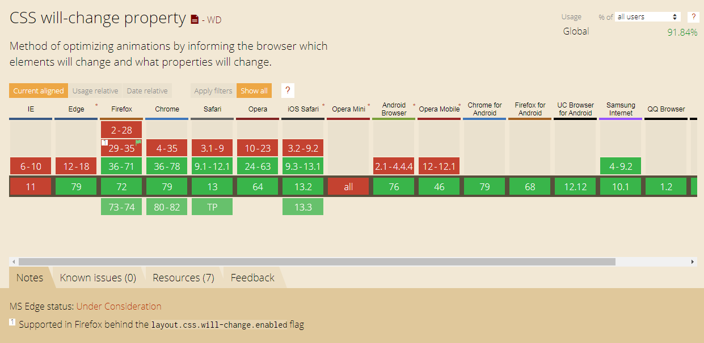

<h1>用CSS来写动画!</h1>

[toc]

---

## animation 属性

动画本身是利用视觉暂留的原理，在一幅画还没有消失前播放下一幅画，就会给人造成一种流畅的视觉变化效果。

而css3动画的是使元素从一种样式逐渐变化为另一种样式，在使用中我们可以让他有多种效果变化，并可建立不同进度时的变换。

## 做一个简单的动画效果吧!

这边先直接放上代码!在这个例子中，若执行，则会3秒内执行完区块从深绿色变成没有颜色的过程，并且在动画结束后还原回默认样式(即闪一下回深绿)。

```html
<style>
    .background-color-transition {
        width: 100%;
        height: 100px;
        margin-bottom: 10px;
        background-color: rgba(0, 150, 136, 1);
        /* 要执行的动画(必须设置) */
        animation-name: deepToShallow;
        /* 动画执行时间(必须设置) */
        animation-duration: 3s;
    }

    /* 动画盒子 动画名称*/
    @keyframes deepToShallow {

        /* 开始 */
        from {
            background-color: rgba(0, 150, 136, 1);
        }

        /* 结束 */
        to {
            background-color: rgba(0, 150, 136, 0);
        }
    }
</style>
<div class="background-color-transition"></div>
```
<style>
    .background-color-transition {
        width: 100%;
        height: 100px;
        margin-bottom: 10px;
        background-color: rgba(0, 150, 136, 1);
        /* 要执行的动画(必须设置) */
        animation-name: deepToShallow;
        /* 动画执行时间(必须设置) */
        animation-duration: 3s;
    }

    /* 动画盒子 动画名称*/
    @keyframes deepToShallow {

        /* 开始 */
        from {
            background-color: rgba(0, 150, 136, 1);
        }

        /* 结束 */
        to {
            background-color: rgba(0, 150, 136, 0);
        }
    }
</style>
<div class="background-color-transition"></div>

`animation-name` 表示定义要执行的动画名称， `animation-duration` 则是定义动画时间(动画时间没设置的话默认为0，即没动画效果;可设置单位为毫秒(ms)或秒(s))。

而 `animation-name` 的 `名子` 则取自 `@keyframes` 的设置，在此例子中`from`设置了动画开始时做的动作，`to`则设置了动画结束时将会过渡到的动作(这种动作的设置即叫**关键帧**)。

如果 `@keyframes` 只设置 `from{...} to{...}` 的话则表示仅设置开始与结束的简单过渡，用 `0%{...} 50%{...} 70%{...} 100%{...}` 这种细项设置则可让动画更完整且流畅。而`from{...} ` 表示100%，`to{...}` 表示0%，故也能这样写 `from{...} 50%{...} 70%{...} to{...}` 。

另外提出来说 `@keyframes` 如果要适配手机端的话，则要加前缀(ex. `@-webkit-keyframe` )。

## 速度曲线、延迟设置、循环播放、循环方向

```html
<style>
    .background-color-transition__item-setting {
        width: 100%;
        height: 100px;
        margin-bottom: 10px;
        background-color: rgba(0, 150, 136, 1);
        /* 要执行的动画(必须设置) */
        animation-name: gradualTransition;
        /* 动画执行时间(必须设置) */
        animation-duration: 3s;
        /* 动画的速度曲线设置(不一定要设置) 平滑过渡*/
        animation-timing-function: ease;
        /* 动画开始之前的等待时间(不一定要设置) (时间若为0.5s使用习惯上则应设置为.5s) */
        animation-delay: 1s;
        /* 动画循环次数(不一定要设置) 无限(设置为数字则为执行次数)*/
        animation-iteration-count: infinite;
        /* 动画循环方向(不一定要设置) 先正向在反向交替运行*/
        animation-direction: alternate;
    }

    /* 动画盒子 动画名称*/
    @keyframes gradualTransition {

        0% {
            background-color: rgba(0, 150, 136, 1);
        }

        25% {
            background-color: rgba(0, 150, 136, 0.5);
        }

        75% {
            background-color: rgba(0, 150, 136, 0.25);
        }

        100% {
            background-color: rgba(0, 150, 136, 0);
        }
    }
</style>

<div class="background-color-transition__item-setting"></div>
```
<style>
    .background-color-transition__item-setting {
        width: 100%;
        height: 100px;
        margin-bottom: 10px;
        background-color: rgba(0, 150, 136, 1);
        animation-name: gradualTransition;
        animation-duration: 3s;
        animation-timing-function: ease;
        animation-delay:1s;
        animation-iteration-count:infinite;
        animation-direction: alternate;
    }

    /* 动画盒子 动画名称*/
    @keyframes gradualTransition {

        0% {
            background-color: rgba(0, 150, 136, 1);
        }

        25% {
            background-color: rgba(0, 150, 136, 0.5);
        }

        75% {
            background-color: rgba(0, 150, 136, 0.25);
        }

        100% {
            background-color: rgba(0, 150, 136, 0);
        }
    }
</style>
<div class="background-color-transition__item-setting"></div>

`animation-timing-function(速度曲线)` 可设可不设，常用的有 **ease-in(慢→快)**、**ease-out(快→慢)**、**ease-in-out(慢→快→慢)** 等。需要的话可以参考[加速度曲线](https://www.jianshu.com/p/d999f090d333)来设置。

`animation-delay(表示动画开始前的等待)` ，可以设置为负值(ex. -2s)，设置为负的话则是**立刻执行并跳过这段时间**(设置的负值时间)**的动画**。

`animation-direction(表示动画播放方向)` ，也就是正序播放(normal: 正常方向)、倒序播放(reverse: 反方向运行)、先**正常**在反向运行(alternate: 会持续交替)、先**反向**在正常运行(alternate-reverse: 会持续交替)，需要注意若动画**不是循环播放**，或说循环次数为1的情况将会没交替作用。

## 动画结束后的状态、中途运行或暂停动画

```html
<style>
    .background-color-transition__item-forwards {
        width: 100%;
        height: 100px;
        margin-bottom: 10px;
        background-color: rgba(0, 150, 136, 1);
        /* 要执行的动画(必须设置) */
        animation-name: run-forwards;
        /* 动画执行时间(必须设置) */
        animation-duration: 3s;
        /* 动画结束后的状态 设置为动画结束时的状态*/
        animation-fill-mode: forwards;        
        /* 动画循环次数(不一定要设置) 无限(设置为数字则为执行次数)*/
        animation-iteration-count: infinite;
    }
    .background-color-transition__item-forwards:hover {
        /* 中途运行或暂停动画 暂停*/
        animation-play-state: paused;
    }
    

    /* 动画盒子 动画名称*/
    @keyframes run-forwards {

        0% {
            background-color: rgba(0, 150, 136, 1);
        }

        25% {
            background-color: rgba(0, 150, 136, 0.5);
        }

        75% {
            background-color: rgba(0, 150, 136, 0.25);
        }

        100% {
            background-color: rgba(0, 150, 136, 0.1);
        }
    }
</style>

<div class="background-color-transition__item-forwards"></div>
```

<style>
    .background-color-transition__item-forwards {
        width: 100%;
        height: 100px;
        margin-bottom: 10px;
        background-color: rgba(0, 150, 136, 1);
        animation-name: run-forwards;
        animation-duration: 3s;
        animation-fill-mode: forwards;
        animation-iteration-count: infinite;
    }
    .background-color-transition__item-forwards:hover {
        animation-play-state: paused;
    }

    /* 动画盒子 动画名称*/
    @keyframes run-forwards {

        0% {
            background-color: rgba(0, 150, 136, 1);
        }

        25% {
            background-color: rgba(0, 150, 136, 0.5);
        }

        75% {
            background-color: rgba(0, 150, 136, 0.25);
        }

        100% {
            background-color: rgba(0, 150, 136, 0.1);
        }
    }
</style>
<div class="background-color-transition__item-forwards"></div>

`animation-fill-mode` 可设置的参数为 `none(默认值，不设置对象动画外的状态)` 、 `forwards(设为结束时的状态)` 、 `backwards(设为开始时的状态)` 、 `both(设置为动画结束或开始的状态)`。

此段代码执行后将会停在 `background-color: rgba(0, 150, 136, 0.1);` 时的模样，但若使用了`animation-fill-mode`属性的话将不能设置动画循环播放，否则动画无法结束那这个效果也将没作用。

`animation-play-state` 可设置的参数则为 `paused` 、`running` 因为属标本身移上去就是running的动作，故在此使用paused来查看暂停动画的用法。

## 动画方式的简写

以下为 animation 设置需依序填写的值。

```css
animation: name duration timing-function delay iteration-count direction fill-mode;
```

假设只设置一个时间，则这时间即为duration，若两个时间 则依序为duration、delay。

需重点设置的项目为name与duration(**动画名称**与**速度**)。

## 如何优化画面的流畅度?

1. position-fixed 替代 background-attachment
2. 带图片的元素放在伪元素中
3. 巧用 will-change

## will-change 硬件加速?

增加页面渲染性能。

- CPU、GPU

CPU 即中央处理器，解释计算机指令以及处里计算机软件中的数据。
GPU 即图形处理器，专门处里和绘制图形相关的硬件。有GPU后CPU就能从图形处里的任务中释放，并执行其他更多的系统任务。

- 硬件加速

将计算量非常大的工作分配给专门的硬件处哩，减轻CPU工作量。

- 现在

CSS不会触发硬件加速，只有3D引擎部分会触发!

- 触发硬件加速

可使用translateZ()触发硬件加速的功能。

- 代价

占用RAM与CPU的存空间。

- 使用方法

will-change可以用auto、scroll-position、contents等方式使用，但建议写成`will-change: top, margin;` 这种明确的可动画的特征值，另外will-change如果所有属性都添加上的话反而会造成效能不必要的消耗(不使用时最好移除 `will-change` 属性。)，影响使用者体验。

- 兼容性

<div class="g-img">
    <a href="../../image/will-change/will-change.png" target="_blank">
        
    </a>
</div>

## 结论

1. 适当的使用will-change，不要所有属性都加
2. 页面上不要有太多动画

<h2>参考文献</h2>

1. [CSS3 动画 Transition, Animation, Transform 基础 [笔记]](https://adon988.logdown.com/posts/4729740-css3-animation-notes)


<style>
    /* 额外调整 */
    pre[class*="language-"] {
      background: rgba(0, 0, 0, 0) !important;
      box-shadow: 0px 0px 3px rgb(222, 222, 222);
      border-left: 3px solid rgba(0, 150, 136, 1);
      border-radius: 0 !important;
    }

    pre[class="language-game-select"] * {
      color: #d42b2b !important;
    }

    .g-hr {
      border-bottom: 1px dashed rgba(0, 150, 136, 1);
      margin-top: 5rem;
      margin-bottom: 5rem;
      height: auto;
      background-color: transparent;
    }

    html body {
      font-family: 'Microsoft YaHei', "Helvetica Neue", Helvetica, "Segoe UI", Arial, freesans, sans-serif !important;
    }

    .g-img {
      text-align: center;
    }

    .g-img img {
      border: 1px solid #d6d6d6;
      border-radius: 8px;
    }
</style>