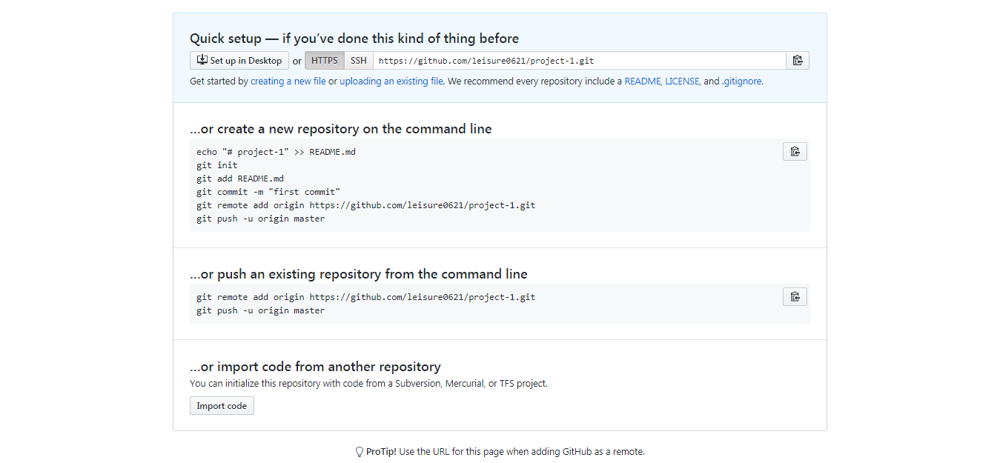
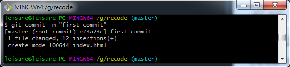
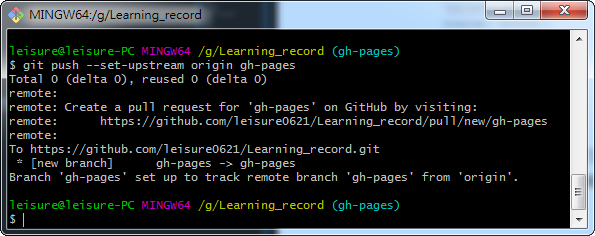

<h1>用 github pages 建立 Blog!</h1>

[toc]

---

## 什么是 github pages?

GitHub Pages是GitHub提供的一个网页寄存服务，于2008年推出。可以用于存放静态网页，包括博客、项目文档甚至整本书。Jekyll软件可以用于将文档转换成静态网页，该软件提供了将网页上传到GitHub Pages的功能

─ 维基百科

## 为什么要使用 github pages?

虽然说GitHub Pages是GitHub提供的一个网页寄存服务，但github使用人数非常多，且使用GitHub Pages的话无须重新配置新的域名，使用几个步骤即可搭建好一个静态网站。

(1) 若只是用于分享技术的话是个很好的平台，且技术难度低!

(2) 之后也能将代码直接放置在github仓库中，优化简历与作品。

(3) 若平时有试着习惯撰写技术文章的话，对沟通与代码的理解性也能更高。

## 开始建立github pages

#### 建立前的准备

(1) 需要先[建立git帐号](https://github.com/)

(2) 需要[下载并安装](https://git-scm.com/downloads)好git

#### 建立一个仓库(Repository)

登入[github](https://github.com/)后，点击右上角的 「+」 并选择 「New repository」

<div class="g-img"><a href="../image/06.png" target="_blank">
    
</a></div>

Repository name 中输入 「github帐号.github.io」，输入完后点击下方的 「Create resposltory」

<div class="g-img"><a href="../image/01.png" target="_blank">
    
</a></div>

接着就能看见的画面，之后可在「Your profile」中查看刚刚建立的项目。进入项目后上面有你项目的git仓库链接，你能够依照上面所教的步骤在你的电脑上部属。或用「git clone 仓库地址」的方式设定（在使用git代码前你首先要去[下载git](https://git-scm.com/downloads)，才能在电脑上使用）

<div class="g-img"><a href="../image/07.png" target="_blank">
    
</a></div>

#### 编辑第一个页面

在设定好项目后，进入目录中。并在该目录下新增一页「index.html」(页面内容能自行编辑)。在推送上线后打开链接，就能直接查看该页面。

(1) 项目位置，依据个人设定的项目位置进入(以下范例为本项目在电脑上配置的目录)。

```git
G:\leisure0621.github.io
```

(2) 文件内容，可以依需求自行修改，也可参考以下代码。

```html
<!DOCTYPE html>
<html lang="en">
<head>
    <meta charset="UTF-8">
    <meta name="viewport" content="width=device-width, initial-scale=1.0">
    <meta http-equiv="X-UA-Compatible" content="ie=edge">
    <title>Home Page</title>
</head>
<body>
    Home Page
</body>
</html>
```

#### 将页面推送上线

(1) 添加待推送档案(add后面加 . 表示所有修改过的档案都要添加)。

```git
git add .
```

<div class="g-img">
    <a href="../image/16.png" target="_blank">
        
    </a>
</div>
<br>

(2) 添加事件名称(名称必须填写的让人明白此次更新的原因)。

```git
git commit -m 'my first commit'
```

<div class="g-img">
    <a href="../image/17.png" target="_blank">
        
    </a>
</div>
<br>

(3) 推送上线。

```git
git push
```

<div class="g-img">
    <a href="../image/18.png" target="_blank">
        
    </a>
</div>

如果需要更细的用法可以至网上搜寻[git push](https://blog.csdn.net/qq_37577660/article/details/78565899)等相关的关键字进行查找，而在当前项目中推送的方式只使用git push的原因为，此项目仅有一个线上分支。所以可用此方法直接推送。

#### 浏览器上查看

在浏览器中输入「https://github帐号.github.io」就可看见刚刚编辑好的画面

<div class="g-img">
    <a href="../image/14.png" target="_blank">
        
    </a>
</div>

如果只有一个项目的时候，所有的页面都可以写在一个仓库当中。但假设越来越多页面的话，应该将每个独立的项目设置为一个独立的repository，未来假设有需要更改。或查看commit时也会更清晰，不容易混淆。

将每个不关联的项目分开，并将每次commit的消息定义的清晰让人一眼可明白此次修改的事件主要有哪些，也是未来该练习的事。


## 建立其他项目仓库

跟一般[建立Repository](https://github.com/new)的方式相同，但此时已经**不需要**像刚开始那样输入「github帐号.github.io」，而是直接输入「项目名称」就能够直接创建。

<div class="g-img">
    <a href="../image/10.png" target="_blank">
        
    </a>
</div>

#### 在本地指定目录clone项目


```git
git clone 仓库链接
```

<div class="g-img">
    <a href="../image/19.png" target="_blank">
        
    </a>
</div>

建立好后，若也在此项目中添加完需上线的资料，则**记得push上线**，都做好后则继续执行后续说明的gh-pages branch指令。

#### 建立 gh-pages branch

gh-pages branch 主要是为了上面所说的事情，「将不关连的项目拆分」以让每个专案的定义更清晰明确，详细依照下方三步骤执行。

(1) 建立并进入gh-pages分支。

```git
git checkout -b gh-pages
```

<div class="g-img">
    <a href="../image/15.png" target="_blank">
        
    </a>
</div>
<br>

(2) 将分支推送上线。

```git
git push --set-upstream origin gh-pages
```

<div class="g-img">
    <a href="../image/11.png" target="_blank">
        
    </a>
</div>
<br>

(3) 将新commit推送上线。

```git
git push
```

<div class="g-img">
    <a href="../image/18.png" target="_blank">
        
    </a>
</div>

#### 在浏览器上查看

在浏览器上打开 https://github帐号.github.io/项目资料夹/ 。

<div class="g-img">
    <a href="../image/20.png" target="_blank">
        
    </a>
</div>

#### 延伸问题 

```js
「gh-pages」 跟「github帐号.github.io」站互相会有什么影响？
```

在gh-pages中如果已经有建立一个项目A、在主页中也建立一个项目A的资料夹的话，会以gh-pages的项目A为主。即只会显示gh-pages的项目资料。

这时就能做到资料拆分的作用，自然的以后也不需要在主页的项目中放多馀的项目文件进去了。