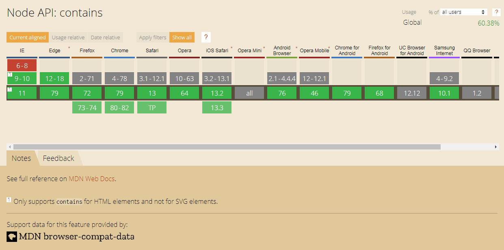
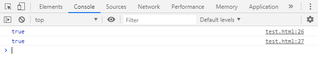

<h1>元素节点类型判断</h1>

[toc]

@import "../../initial.css"

---

## 判断是否为HTML或XML元素节点

首先元素节点判断的话可以先用这种比较简略的方式判定是否为html的元素节点，这时候就可判断出仅有 obj3 是正确的元素节点。

```js
function isHTMLElement(obj){  
    // 创建节点
    var d = document.createElement("div");

    try{
        // <div></div>
        d.appendChild(obj.cloneNode(true)); 
        // 判断是否为元素节点
        return obj.nodeType == 1 ? true : false;  
    }catch(e){  
        return false;  
    }  
}  

var obj1 = {nodeType:1};  
var obj2 = document.createTextNode("hello");  
var obj3 = document.createElement("p");  
isHTMLElement(obj1);//false  
isHTMLElement(obj2);//false  
isHTMLElement(obj3);//true 
```

接着为了兼容IE9，也为了判断是否为XML则如以下扩展。

```js
var d = document.createElement('div');  
var isElement = function (obj) {
    // 使用 nodeType 判断是否为元素节点
    if (obj && obj.nodeType === 1) {
        // 使用 instanceof 判断是否为Node实例，主要为了兼容IE9
        if( window.Node && (obj instanceof Node) ){
            return true;
        }  
        try {
            // 最后使用这种方法判断，若为元素节点则会返回 true 。不过虽然可行性高，但效率低
            d.appendChild(obj);
            d.removeChild(obj);
        } catch (e) {  
            return false;  
        }  
        return true;  
    }  
    return false;  
}  
var isXML = function(doc) {
    // xml与html都支持createElement方法。而使用此方式判断的原因是因为 XML区分大小写
    // 若是在html文档中创建的话，则nodeName都为大写P，所以这判断就会是真
    return doc.createElement("p").nodeName !== doc.createElement("P").nodeName;  
}  
var isHTMLElement = function(el){
    // 判断是否为元素节点
    if(isElement(el)){
        // 判断是否为HTML节点
        return !isXML(el.ownerDocument);  
    }  
    return false;  
}
window.onload = function() {
    console.log(isHTMLElement(d)); // true
};
```

## 如何判断节点的包含关系

其实这意思就是「如何判断一个元素是否为另一个元素的子元素」。具体的实践方法可以使用contains。

```html
<div id="father">  
    <div id="child">子节点内容</div>  
</div>

<script>
    var father = document.getElementById("father");  
    var child = document.getElementById("child").childNodes[0];  

    console.log(father.contains(child));
</script>
```

但contains的方法并不兼容IE8以下，故如果要兼容的话还是要另想方法。

<div class="g-img">
    <a href="../../image/contains/contains.png" target="_blank">
        
    </a>
</div>

使用下列方式可以兼容IE8以下的所有情境，且也可比对元素是否是document中的子元素。

```html
<div id="father">  
    <div id="child">子节点内容</div>  
</div>
<script>
    function compatibleContains(a, b) {  
        try {  
            while (b = b.parentNode){  
                if (b === a){  
                    return true;  
                }  
            }  
            return false;  
        } catch (e) {  
            return false;  
        }  
    }  
    var father = document.getElementById("father");  
    var child = document.getElementById("child").childNodes[0]; 
    console.log(compatibleContains(father, child));  
    console.log(compatibleContains(document, child));
</script> 
```

<div class="g-img">
    <a href="../../image/contains/contains-ans.png" target="_blank">
        
    </a>
</div>

但如果开发环境不需要支持旧版IE的话则直接使用contains即可。

<h2>参考文献</h2>

1. [instanceof](https://developer.mozilla.org/zh-CN/docs/Web/JavaScript/Reference/Operators/instanceof)
2. [HTMLDocument](https://developer.mozilla.org/zh-CN/docs/Web/API/HTMLDocument)
3. [createDocument](https://developer.mozilla.org/zh-CN/docs/Web/API/DOMImplementation/createDocument)
4. [DOM探索之-元素节点的判断](https://www.geekjc.com/post/5c2f93f6e916421a8f1f4b00)
5. [判断元素是否为HTMLElement元素](https://www.iteye.com/topic/566058)
6. [javascript contains方法来判断元素包含关系](https://js8.in/2012/01/04/javascript-contains%E6%96%B9%E6%B3%95%E6%9D%A5%E5%88%A4%E6%96%AD%E5%85%83%E7%B4%A0%E5%8C%85%E5%90%AB%E5%85%B3%E7%B3%BB/)