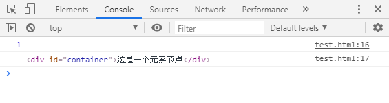

<h1>nodeType 、nodeName 与 nodeValue 要怎么使用?</h1>

[toc]

---

#### nodeType 节点类型

nodeType可用来区分不同的节点类型。

#### nodeType 常量说明

| 字符常量               | 数值常量 | 描述                                                                                  |
| :--------------------- | :------- | :------------------------------------------------------------------------------------ |
| ELEMENT_NODE           | 1        | 一个 元素 节点，例如 `<p>` 、 `<div>` 、`<script>`、`<style>` 、`<html>` 、`<body>`。 |
| TEXT_NODE              | 3        | Element 或者 Attr 中的文字(包含换行与空白)                                            |
| COMMENT_NODE           | 8        | 一个 Comment 节点。例如 `<!-- ... -->` 中的内容                                       |
| DOCUMENT_NODE          | 9        | 一个 Document 节点。                                                                  |
| DOCUMENT_TYPE_NODE     | 10       | 描述文档类型的 DocumentType 节点。例如 `<!DOCTYPE html>`  就是用于 HTML5 的。         |
| DOCUMENT_FRAGMENT_NODE | 11       | 一个 DocumentFragment 节点                                                            |
#### nodeType 用法实践

例子: 

```html
<div id="container">这是一个元素节点</div>
<script>
    var divNode = document.getElementById('container');

    console.log(divNode.nodeType); // 1 ，也可用console的方式打印出值
    console.log(divNode); // <div id="container">这是一个元素节点</div> ，也可以在这直接打印出divNode到底是什么
</script>
```

执行结果:

```git
1
```

```git
<div id="container">这是一个元素节点</div>
```

如果仅仅是想查看常量所代表的值，可以在浏览器的Console中贴上 `Node.TEXT_NODE` 就会直接打印出结果，如果是要查看其他常量所代表的值则一律 `Node.字符常量` 。

<div class="g-img">
    <a href="../../image/nodeType-nodeName-nodeValue/nodeType.png" target="_blank">
        
    </a>
</div>

#### nodeType 用字符常量好还是用数值常量来比对的好?

虽说再判断该节点是否等于指定常量时，用字符常量的话判断会比较方便，且易懂。

但在兼容的部分，**字符常量不兼容于IE8**，故在实际使用时多以数值常量做判断

<h2>参考文献</h2>

1. [MDN nodeType](https://developer.mozilla.org/zh-CN/docs/Web/API/Node/nodeType)
2. [jQuery-选取器](https://kanboo.github.io/2018/05/31/jQuery-Selector/)


<style>
    /* 额外调整 */
    pre[class*="language-"] {
      background: rgba(0, 0, 0, 0) !important;
      box-shadow: 0px 0px 3px rgb(222, 222, 222);
      border-left: 3px solid rgba(0, 150, 136, 1);
      border-radius: 0 !important;
    }

    pre[class="language-game-select"] * {
      color: #d42b2b !important;
    }

    .g-hr {
      border-bottom: 1px dashed rgba(0, 150, 136, 1);
      margin-top: 5rem;
      margin-bottom: 5rem;
      height: auto;
      background-color: transparent;
    }

    html body {
      font-family: 'Microsoft YaHei', "Helvetica Neue", Helvetica, "Segoe UI", Arial, freesans, sans-serif !important;
    }

    .g-img {
      text-align: center;
    }

    .g-img img {
      border: 1px solid #d6d6d6;
      border-radius: 8px;
    }
</style>