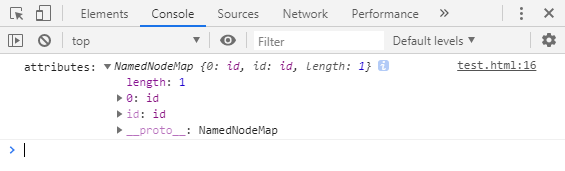

<h1>nodeType 、nodeName 与 nodeValue 要怎么使用?</h1>

[toc]

---

## nodeType 的作用与说明

#### 节点类型

nodeType可用来区分不同的节点类型。

#### 常量说明

| 字符常量               | 数值常量 | 描述                                                                                  |
| :--------------------- | :------- | :------------------------------------------------------------------------------------ |
| ELEMENT_NODE           | 1        | 一个 元素 节点，例如 `<p>` 、 `<div>` 、`<script>`、`<style>` 、`<html>` 、`<body>`。 |
| TEXT_NODE              | 3        | Element 或者 Attr 中的文字(包含换行与空白)                                            |
| COMMENT_NODE           | 8        | 一个 Comment 节点。例如 `<!-- ... -->` 中的内容                                       |
| DOCUMENT_NODE          | 9        | 一个 Document 节点。                                                                  |
| DOCUMENT_TYPE_NODE     | 10       | 描述文档类型的 DocumentType 节点。例如 `<!DOCTYPE html>`  就是用于 HTML5 的。         |
| DOCUMENT_FRAGMENT_NODE | 11       | 一个 DocumentFragment 节点                                                            |
#### 用法实践

在获取元素节点之后，若要比对是什么节点类型的话则需使用 `nodeType` 的方式，返回值则为 `数字` 类型。

最终此值可与 `Node.ELEMENT_NODE` 等方式做对比，处理各节点类型所需执行的动作

```html
<div id="container">这是一个元素节点</div>
<script>
    var divNode = document.getElementById('container');

    console.log(divNode.nodeType);
    console.log(divNode);
</script>
```

<div class="g-img">
    <a href="../../image/nodeType-nodeName-nodeValue/nodeType.png" target="_blank">
        
    </a>
</div>

如果仅仅是想查看常量所代表的值，可以在浏览器的Console中贴上 `Node.TEXT_NODE` 就会直接打印出结果，如果是要查看其他常量所代表的值则一律 `Node.字符常量` 。

<div class="g-img">
    <a href="../../image/nodeType-nodeName-nodeValue/nodeType-TEXT_NODE.png" target="_blank">
        
    </a>
</div>

#### "字符常量"好还是用"数值常量"来比对的好?

虽说再判断该节点是否等于指定常量时，用字符常量的话判断会比较方便，且易懂。

但在兼容的部分，**字符常量不兼容于IE8**，故在实际使用时多以数值常量做判断


## nodeName 与 nodeValue 的作用与说明

#### nodeName 与 nodeValue 分别代表的意思?

利用这两个方法分别可以返回**节点名称(nodeName)**与**节点值(nodeValue)** 。

#### 用法实践

若要得知该节点的 nodeName 与 nodeValue 则可以在使用getElementId后再使用 `nodeName` 、 `nodeValue` 的方式取得。

```html
<div id="container">这是一个元素节点</div>
<script>
    var divNode = document.getElementById('container');

    console.log('nodeName',divNode.nodeName);
    console.log('nodeValue',divNode.nodeValue);
</script>
```

<div class="g-img">
    <a href="../../image/nodeType-nodeName-nodeValue/nodeName-nodeValue.png" target="_blank">
        
    </a>
</div>

此时如果想获取元素的id等其他资料则可用 `attributes` 这个属性**保存了 div 元素内的所有属性**，可以用类似数组的方式获取所有属性。

```html
<div id="container">这是一个元素节点</div>
<script>
    var divNode = document.getElementById('container');
    var attrNode = divNode.attributes;
    console.log('attributes:', attrNode);
</script>
```

<div class="g-img">
    <a href="../../image/nodeType-nodeName-nodeValue/node-attributes.png" target="_blank">
        
    </a>
</div>

假设是要取得元素id的话则可用 `attrNode[0].nodeName` 的方式获取属性节点，与 `attrNode[0].nodeValue` 属性值。

<div class="g-img">
    <a href="../../image/nodeType-nodeName-nodeValue/node-attributes-id.png" target="_blank">
        
    </a>
</div>

而若要获取子元素的话，则使用 `childNodes` 的方式。由于这也是类数组的方式，故也可用数组的方式访问节点。

```html
<div id="container">这是一个元素节点</div>
<script>
    var divNode = document.getElementById('container');
    console.log('childNodes:', divNode.childNodes);
</script>
```

<div class="g-img">
    <a href="../../image/nodeType-nodeName-nodeValue/node-childNodes.png" target="_blank">
        
    </a>
</div>

假设进阶一点，要获取页面中body下的子元素的话可以使用 `document.body.childNodes` 的方式。

如果要获得注释节点对象的话，`document.body.childNodes[1]` 则要取得位置为 1 的值。因为在body结构中第一个值为换行符之后才是注释，而后的值则依序排列。

```html
<!DOCTYPE html>
<html lang="en">

<head>
    <meta charset="UTF-8">
    <meta name="viewport" content="width=device-width, initial-scale=1.0">
    <meta http-equiv="X-UA-Compatible" content="ie=edge">
    <title>Document</title>
</head>

<body>
    <!-- 这是一个 childNodes 的实验 -->
    <div id="container">这是一个元素节点</div>
    <script>
        var bodyNode = document.body.childNodes;
        console.log(bodyNode);
    </script>
</body>

</html>
```

<div class="g-img">
    <a href="../../image/nodeType-nodeName-nodeValue/node-body-childNodes.png" target="_blank">
        
    </a>
</div>

若要取得的对象为文档类型节点则可直接使用 `document.doctype` 的方式获得。

```html
<!-- 这是一个 childNodes 的实验 -->
<div id="container">这是一个元素节点</div>
<script>
    var doctypeNode = document.doctype;
    console.log(doctypeNode);
</script>
```

<div class="g-img">
    <a href="../../image/nodeType-nodeName-nodeValue/node-documentType.png" target="_blank">
        
    </a>
</div>

假设要创建一个文档片段的话则使用 `createDocumentFragment()` 。

```html
<!-- 这是一个 childNodes 的实验 -->
<div id="container">这是一个元素节点</div>
<script>
    var frag = document.createDocumentFragment();
    console.log("nodeName",frag.nodeName);
    console.log("nodeValue",frag.nodeValue);
</script>
```

<div class="g-img">
    <a href="../../image/nodeType-nodeName-nodeValue/node-frag.png" target="_blank">
        
    </a>
</div>

## 结论

| 方法                              | 说明                 |
| :-------------------------------- | :------------------- |
| Node.nodeType                     | 取得节点类型         |
| Node.nodeName                     | 取得节点名称         |
| Node.nodeValue                    | 取得节点值           |
| Node.attrNode                     | 获取素内的所有属性   |
| Node.childNodes                   | 获取子元素的所有资料 |
| document.doctype                  | 获取文档类型节点     |
| document.createDocumentFragment() | 建立文档片段         |

这些为此次内容所述的所有方法，`Node` 可直接替换为 `document.getElementById()` 等方式使用。

因为兼容性，`nodeType` 建议以 `数值常量` 来做比对。

<h2>参考文献</h2>

1. [MDN nodeType](https://developer.mozilla.org/zh-CN/docs/Web/API/Node/nodeType)
2. [jQuery-选取器](https://kanboo.github.io/2018/05/31/jQuery-Selector/)


<style>
    /* 额外调整 */
    pre[class*="language-"] {
      background: rgba(0, 0, 0, 0) !important;
      box-shadow: 0px 0px 3px rgb(222, 222, 222);
      border-left: 3px solid rgba(0, 150, 136, 1);
      border-radius: 0 !important;
    }

    pre[class="language-game-select"] * {
      color: #d42b2b !important;
    }

    .g-hr {
      border-bottom: 1px dashed rgba(0, 150, 136, 1);
      margin-top: 5rem;
      margin-bottom: 5rem;
      height: auto;
      background-color: transparent;
    }

    html body {
      font-family: 'Microsoft YaHei', "Helvetica Neue", Helvetica, "Segoe UI", Arial, freesans, sans-serif !important;
    }

    .g-img {
      text-align: center;
    }

    .g-img img {
      border: 1px solid #d6d6d6;
      border-radius: 8px;
    }
</style>