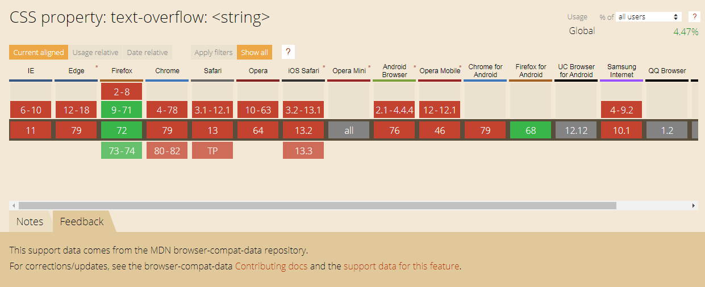
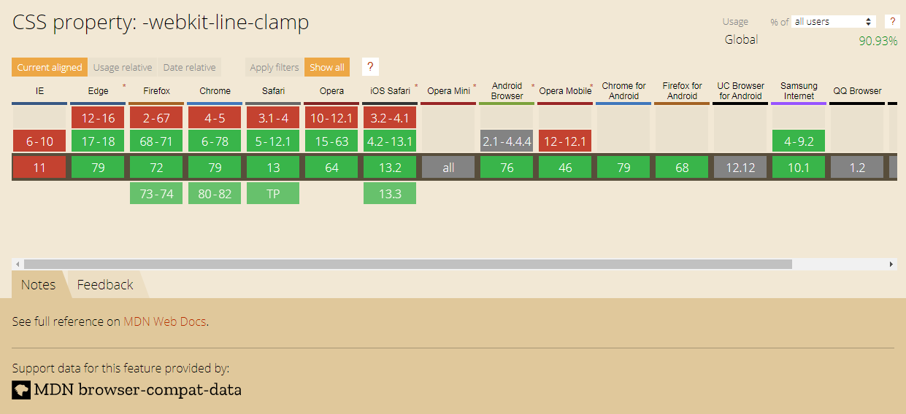

<h1>text-overflow的使用</h1>

[toc]

---

## text-overflow 的作用?

text-overflow 主要是用在文本溢出的情况，若搭配的使用此元素的话，直接用css就能显示出省略号(...)，不然就需要使用js才能做到了。

## text-overflow 的语法?

text-overflow: clip | ellipsis | string ;

| 语法     | 说明                   |
| :------- | :--------------------- |
| clip     | 溢出后直接截断         |
| ellipsis | 溢出后加省略号         |
| string   | 溢出后替换被截断的文本 |

## text-overflow 使用效果?

| 语法                             | 数值       | 结果     |
| :------------------------------- | :--------- | :------- |
| text-overflow: clip              | 1234567890 | 123456   |
| text-overflow: ellipsis          | 1234567890 | 1234...  |
| text-overflow: ellipsis ellipsis | 1234567890 | ...34... |
| text-overflow: '.'               | 1234567890 | 1234.    |
| text-overflow: ',' '.'           | 1234567890 | ,34.     |

## 单行溢出省略

部分浏览器若使用text-overflow的话需设置宽度。

```html
<style>
.overflow-ellipsis {
    overflow: hidden;
    text-overflow: ellipsis;
    white-space: nowrap;
    width: 200px;
}
</style>

<p class='overflow-ellipsis'>
    What is Lorem Ipsum?
    Lorem Ipsum is simply dummy text of the printing and typesetting industry. Lorem Ipsum has been the industry's
    standard dummy text ever since the 1500s, when an unknown printer took a galley of type and scrambled it to make
    a type specimen book. It has survived not only five centuries, but also the leap into electronic typesetting,
    remaining essentially unchanged. It was popularised in the 1960s with the release of Letraset sheets containing
    Lorem Ipsum passages, and more recently with desktop publishing software like Aldus PageMaker including versions
    of Lorem Ipsum.
</p>
```

执行效果:

```
What is Lorem Ipsum? Lorem Ipsum is ...
```

## 多行溢出省略

使用多行溢出的话，可使用-webkit-line-clamp作设置，其中的数值就是要显示的行数

```html
<style>
.overflow-ellipsis {
    overflow: hidden;
    text-overflow: ellipsis;
    display: -webkit-box;
    -webkit-line-clamp: 2;
    -webkit-box-orient: vertical;
    width: 200px;
}
</style>

<p class='overflow-ellipsis'>
    What is Lorem Ipsum?
    Lorem Ipsum is simply dummy text of the printing and typesetting industry. Lorem Ipsum has been the industry's
    standard dummy text ever since the 1500s, when an unknown printer took a galley of type and scrambled it to make
    a type specimen book. It has survived not only five centuries, but also the leap into electronic typesetting,
    remaining essentially unchanged. It was popularised in the 1960s with the release of Letraset sheets containing
    Lorem Ipsum passages, and more recently with desktop publishing software like Aldus PageMaker including versions
    of Lorem Ipsum.
</p>
```

执行效果:

```
What is Lorem Ipsum? Lorem 
Ipsum is simply dummy text ...
```

## 浏览器适配

因为IE的版本目前都不支持-webkit-line-clamp的使用，故为了项目需要可改用:after的方式添加省略号。

但需要注意的是，在使用的同时需要注意溢出时的line-height的高(否则文字会被截断)，且height为须显示的行数。

```html
<style>
.overflow-ellipsis {
    position: relative;
    line-height: 1.5em;
    height: 3em;
    overflow: hidden;
    width: 200px;
}

.overflow-ellipsis:after {
    content: "...";
    position: absolute;
    bottom: 0;
    right: 0;
    padding: 0 5px;
    background-color: #fff;
}
</style>

<p class='overflow-ellipsis'>
    What is Lorem Ipsum?
    Lorem Ipsum is simply dummy text of the printing and typesetting industry. Lorem Ipsum has been the industry's
    standard dummy text ever since the 1500s, when an unknown printer took a galley of type and scrambled it to make
    a type specimen book. It has survived not only five centuries, but also the leap into electronic typesetting,
    remaining essentially unchanged. It was popularised in the 1960s with the release of Letraset sheets containing
    Lorem Ipsum passages, and more recently with desktop publishing software like Aldus PageMaker including versions
    of Lorem Ipsum.
</p>
```

执行效果:

```
What is Lorem Ipsum? Lorem 
Ipsum is simply dummy text ...
```

## 结论

虽然text-overflow已支持string属性，但此属性的[兼容性不佳](https://caniuse.com/#search=text-overflow)，故使用上仍建议使用clip或ellipsis。

其中最常用的应为ellipsis，用作文本溢出省略号。

<div class="g-img">
    <a href="../image/css-text-overflow/text-overflow.png" target="_blank">
        
    </a>
</div>

除了单行溢出外页面上也经常需使用到多行文本溢出，此时若看到-webkit-line-clamp的话就可知主流浏览器新版本的部分大多都支持(除了IE)，故为了兼容性也会配合:after使用。

<div class="g-img">
    <a href="../image/css-text-overflow/line-clamp.png" target="_blank">
        
    </a>
</div>
