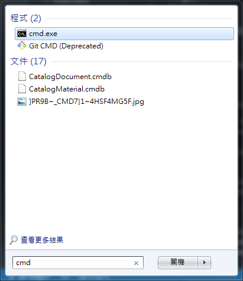
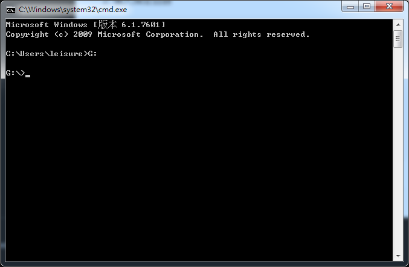
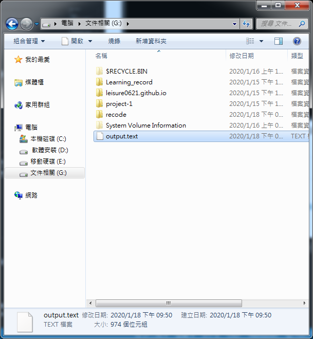

<h1>如何导出目录树</h1>

[toc]

---

## 开启cmd介面

若有使用vscode则也可以直接在终端使用

<div class="g-img">
    <a href="../../image/directory-tree/21.png" target="_blank">
        
    </a>
</div>

## 进入指定目录

<div class="g-img">
    <a href="../../image/directory-tree/22.png" target="_blank">
        
    </a>
</div>

## 输入指令

在介面上右键并将以下指令贴上，输入指令后即导出(导出时可指定导出的文件名称与副档名)在该目录中。

```git
tree /a /f > output.text
```

## 导出结果

<div class="g-img">
    <a href="../../image/directory-tree/23.png" target="_blank">
        
    </a>
</div>

<h2>参考文献</h2>

1. [How to export the directory tree of a folder in Windows](https://www.digitalcitizen.life/how-export-directory-tree-folder-windows)
